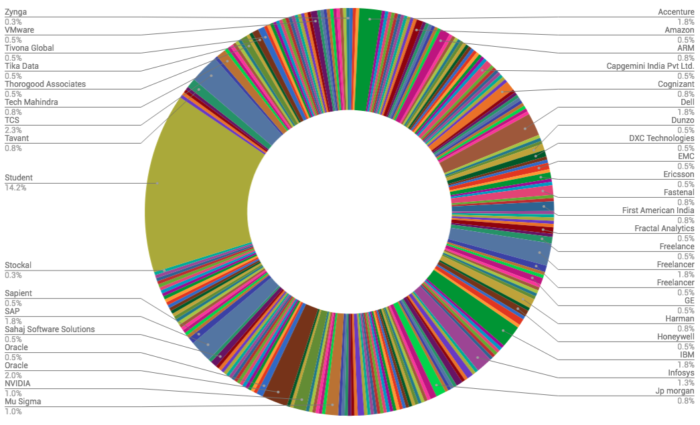
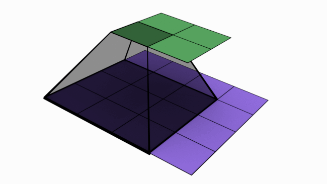
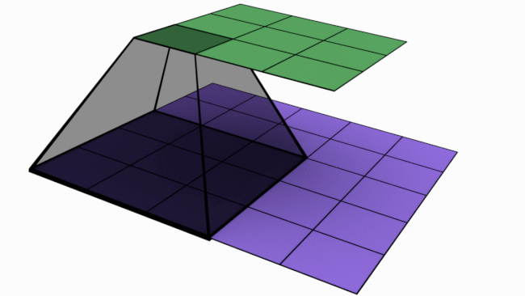
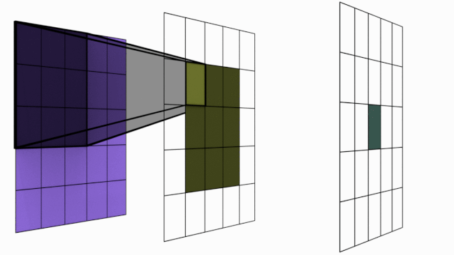
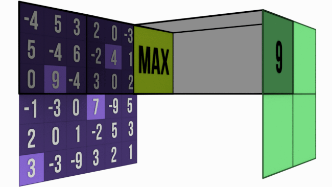
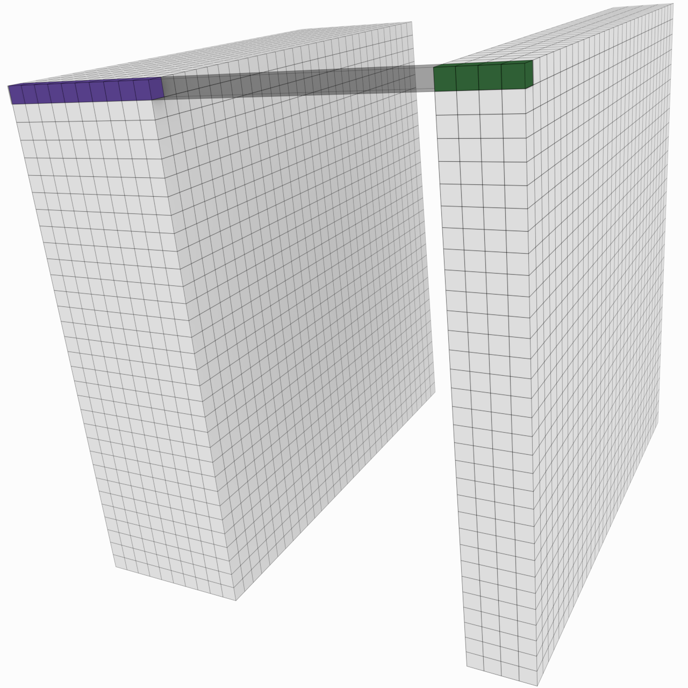

# Session 1


----
<br>
<br>
<br>
<br>
<br>
<br>
<br>
<br>

>Welcome Everyone!
>
<br>
<br>
<br>
<br>
<br>
<br>

**Perface? Sort of!**
1. We received staggering 660+ application for this EIP
2. Finally we have 445 EInterns, split into 7 Batches
3. Professional vs Student ratio is not 85+%!
4. People from your batch are from - DxC Technology - First American, Freelancer, Ernst & Young, Thorogood Associates, IISc, Neustar, KNAB FInance, Accenture, Sigtuple, Mahindra Electric Mobility Ltd., Moody's Analytics, Skillspeed, Cognizant Technology Solutions, Bsharp Sales Enabler, Jifflenow, NVIDIA, Amazon, Kint, IBM, CMR, IIIT, InGene Dynamics, Alten Calsoft Labs, Porter, Geekskool, SAP Labs, Tharsha Ventures, Touchkin, Analytics Quotient, Microchip, Unisys, HP, TCS, IMS Health, Reflik, 3 Frames Lab, Velotio Technologies, Mu Sigma, Capgemini, KNOWLEDGEHUT, HCL, NVIDIA, etc.
5. We are really proud of what we are trying to achieve here today!



<br>
<br>
<br>
<br>
<br>
<br>
<br>
<br>

**Administrative Stuff:**
1. Make sure you have a Google Colab Account
2. Make sure you are there on main WhatsApp group. Please keep this group "Mute" as people are posting random stuff. 
3. Please join our Discourse forum, hosted at mlblr.com/discourse to discuss about topics 

<br>
<br>
<br>
<br>
<br>
<br>
<br>
<br>

### External Internship Program 

1. We have 2 hours of 10 session, spread over 40-50 days
2. 2 hours per session is really too less to become a master. 
3. Our aim is to get you started, covering the fundamentals. Unless you spend at least 3-4 hours on your own reading-doing stuff, this program would fail for you. 
4. Assignments are designed to this specific purpose. Since 87.5% are from industry, there might be some resistance to become a student again, but let's try!
4. Our relation with you is "Driving Instructor - New Driver" and not of "Professor - Student". This means our focus is on to help you drive the car, not to understand it's internal fundamentals (a rule we will break many times). 
5. If the batch is running slow, we will cover lesser content in 10 sessions, instead of rushing through everything. 

<br>
<br>
<br>
<br>
<br>
<br>
<br>
<br>

## Let's get started


<br>
<br>
<br>
<br>
<br>
<br>
<br>
<br>

> This is how we want you to feel after the 10 sessions
> 


<br>
<br>
<br>
<br>
<br>
<br>
<br>
<br>

### Building the Intuition!

<br>
<br>

<br>
<br>
<br>
<br>
<br>
<br>
<br>
<br>

<br>
<br>
<br>
<br>
<br>
<br>

##### OUR BRAIN


> An ultra dense connected network of flowing information


<br>
<br>
<br>
<br>
<br>
<br>
<br>
<br>

## EYES


<br>
<br>
<br>
<br>
<br>
<br>
<br>
<br>


>Light to Neurons

<br>
<br>
<br>
<br>
<br>
<br>
<br>
<br>

<br>
<br>
<br>
<br>
<br>
<br>
<br>
<br>


<br>
<br>
<br>
<br>
<br>
<br>
<br>
<br>
>This is where image to RGB/GrayScale convesion ends!
<br>
<br>
<br>
<br>
<br>
<br>
<br>
<br>

## BORED CAT EXPERIMENT


<br>
<br>
<br>
<br>
<br>
<br>
<br>
<br>
<br>


> Radioactive Glucose
> 


<br>
<br>
<br>
<br>
<br>
<br>
<br>
<br>

Retinotopic Map


<br>
<br>
<br>
<br>
<br>
<br>
<br>
<br>

Edge Detection


<br>
<br>
<br>
<br>
<br>
<br>
<br>
<br>

<br>
<br>
<br>
<br>
<br>
<br>
<br>
<br>


## Coretex Processing


<br>
<br>
<br>
<br>
<br>
<br>
<br>
<br>

<br>
<br>
<br>
<br>
<br>
<br>
<br>
<br>


<br>
<br>
<br>
<br>
<br>
<br>
<br>
<br>


<br>
<br>
<br>
<br>
<br>
<br>
<br>
<br>

<br>
<br>
<br>
<br>
<br>
<br>
<br>
<br>


_____

# Back to Neural Computing

We need feature extraction methods and then combining methods


Let's look at some code. 

# Welcome Convolution - Feature Extraction


## Combining these concepts


Closer Look


<br>
<br>
<br>
<br>
<br>
<br>
<br>
<br>
<br>
<br>
<br>
<br>
<br>
<br>
<br>
<br>

# Concepts

<br>
<br>
<br>
<br>
<br>
<br>
<br>
<br>
<br>
<br>
<br>
<br>
<br>
<br>
<br>
<br>

## What is convolution?




## input(28x28x1)
## Conv2D(32, 3, 3, act=ReLU) >?
## MaxPooling(2) >?
## Activation (ReLU) << Useless here. 
## Conv2D(10, 1, 1, act=ReLU) Perfectly OK
## Conv2D(10, 13, 13, act=None) >?
## SoftMax()
## Compile/Fit/Optimize
<br>
<br>
<br>
<br>
<br>
<br>
<br>
<br>

<br>
<br>
<br>
<br>
<br>
<br>
<br>
<br>

## What do we gain and what do we lose?




<br>
<br>
<br>
<br>
<br>
<br>
<br>
<br>

<br>
<br>
<br>
<br>
<br>
<br>
<br>
<br>

## Why do we add layers? 




<br>
<br>
<br>
<br>
<br>
<br>
<br>
<br>

<br>
<br>
<br>
<br>
<br>
<br>
<br>
<br>

## How many layers would we need to move from 400x400 image to 100 numbers? 


<br>
<br>
<br>
<br>
<br>
<br>
<br>
<br>
<br>
<br>
<br>
<br>
<br>
<br>
<br>
<br>

## MaxPooling (about to get obsolete)




<br>
<br>
<br>
<br>
<br>
<br>
<br>
<br>

<br>
<br>
<br>
<br>
<br>
<br>
<br>
<br>

## Let's build a network!
<br>
<br>
<br>
<br>
<br>
<br>
<br>
<br>

<br>
<br>
<br>
<br>
<br>
<br>
<br>
<br>


## 3x3 is a lie! How convolution actually works? 


<br>
<br>
<br>
<br>
<br>
<br>
<br>
<br>

<br>
<br>
<br>
<br>
<br>
<br>
<br>
<br>

## The reason for dimensional reductionality!

But what about z (or channels)?
<br>
<br>
<br>
<br>
<br>
<br>
<br>
<br>

<br>
<br>
<br>
<br>
<br>
<br>
<br>
<br>

## Welcome to 1x1 convolution?



<br>
<br>
<br>
<br>
<br>
<br>
<br>
<br>

<br>
<br>
<br>
<br>
<br>
<br>
<br>
<br>

## Let's see some animation. 


## Let's build the network again!
<br>
<br>
<br>
<br>
<br>
<br>
<br>
<br>

<br>
<br>
<br>
<br>
<br>
<br>
<br>
<br>

## What happens when we train a network? 

This is what happens over a period of time to our neurons/kernels/filters

<br>
<br>
<br>
<br>
<br>
<br>
<br>
<br>

<br>
<br>
<br>
<br>
<br>
<br>
<br>
<br>

# Let's look at the code:

```python
 
model.add(Convolution2D(32, 3, 3, activation='relu', input_shape=(28,28,1)))
model.add(Convolution2D(10, 1, activation='relu'))
model.add(Convolution2D(10, 26))
model.add(Flatten())
model.add(Activation('softmax'))
```
# bit.ly/2IBqQJD


<br>
<br>
<br>
<br>
<br>
<br>
<br>
<br>

# Story of Harry Potter

> I didn't read the book!
> 

Character | Age 
--- | ---
Harry | 28
Me | 24 :D
You | 30 XD


$x_2^2 = f(Harry)$
<br>
<br>
<br>
<br>
<br>
<br>
<br>
<br>

# ASSIGNMENT 1

* Download Boostnote (or any markdown editor you prefer)
* You can refer this link to learn about markdown: [Markdown Cheatsheet](https://github.com/adam-p/markdown-here/wiki/Markdown-Cheatsheet)
* Write 2 articles between 100-200 words in markdown and email back your file in this format **FIRSTNAME_BATCH_X_ASSIGNMENT1.md** 
* You must mention your name, batch number in your markdown file. 
* Your markdown file must have an image of your choice. 
* You can pick any 2 from these topics:
  * Convolution
  * Filters/Kernels
  * Epochs
  * 1x1 convolution
  * 3x3 convolution
  * Feature Maps
  * Feature Engineering
* Bonus points if you write on any of these:
  * Activation Function
  * How to create an account on GitHub and upload a sample project
  * Receptive Field. 
  * 10 examples of use of MathJax in Markdown
* Deadline Tuesday 11:30PM
* You **MUST** use your own words while writing any of the above, if we find plagiarism, 0 marks would be awarded for that article. 